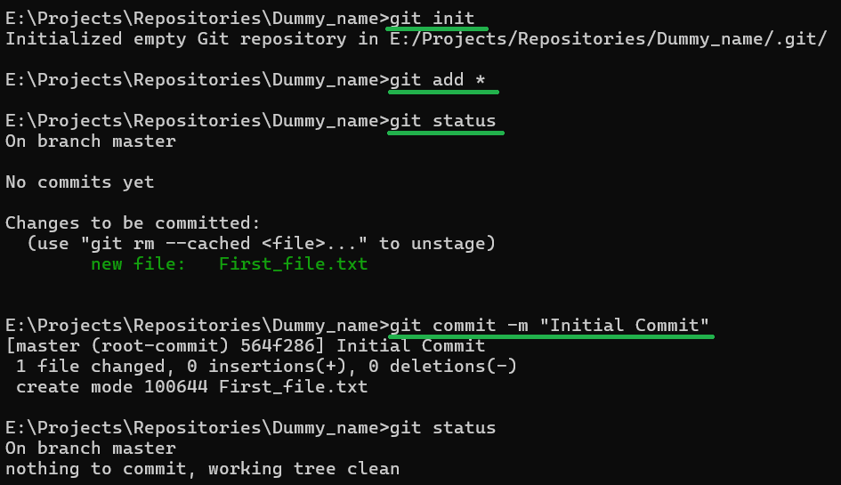

Here is how I created this simple git repository on my device (local machine, not linked with GitHub.com)

Step #1: Create a New Folder for your project

Step #2: Open command line inside the folder and enter the following commands:

Details of the Commands:-

'git init' 
- Initializes your project folder as a git repository. Now all the changes in this folder can be tracked.

'git add' 
- Adds the content of this folder into a "staging area".
- '*' is a parameter that indicates "all the files". 
- Hence, 'git add *' will add all the files/folders to the "staging area".
- 'git add file_name' will add a specific file "file_name" into the "staging area"

'git status' 
- Shows you the status of all the files/folders in your project folder.
- Files marked in "green" indicate "staged files"
- Files marked in "red" indicate "unstaged files"

'git commit' 
- Will commit i.e. record the current stage of the project folder.
- '-m' parameter indicates that we are adding a commit message for our referance to know what changes we made in this commit. Followed by the actual message in double quotes ("_")
- Hence, 'git commit -m "Initial Commit"' will record our first commit with the given commit message. It is a standard practice to label your first commit as "Initial Commit".

# Unstage a staged file

If you mistakenly '''git add''' a file. You can unstage it using the following command:
'''git restore --staged "Add_nested_repository"'''

Reference: [Link](https://www.theserverside.com/blog/Coffee-Talk-Java-News-Stories-and-Opinions/git-unstage-file-all-index-commit-folder-add-delete)